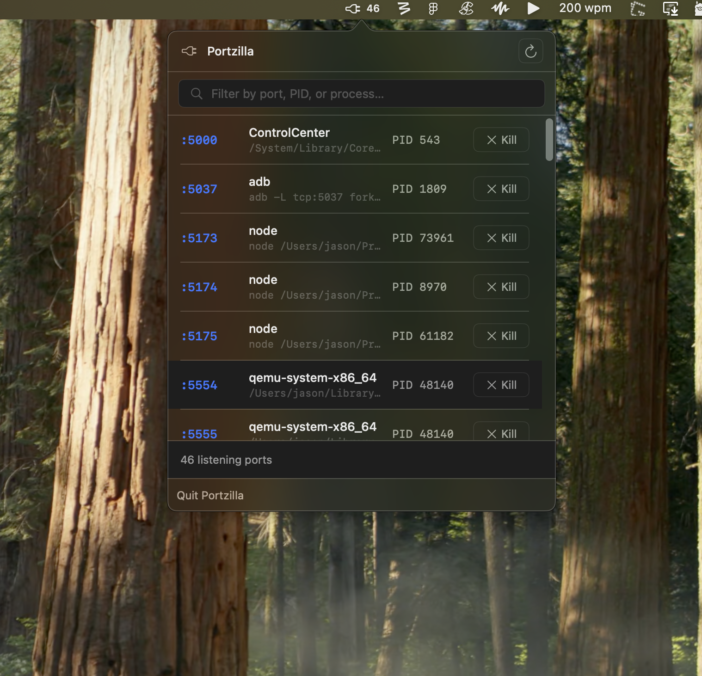

# Portzilla

[](https://github.com/cilladev/portzilla/actions/workflows/test.yml)


A macOS menu bar app for listing and killing processes bound to local ports. Hit `EADDRINUSE`? Click once instead of running `lsof` + `kill`.



## Requirements

- macOS 13+ (Ventura)
- Swift 5.9+

## Quick start

```bash
git clone https://github.com/cilladev/portzilla.git && cd portzilla
swift run
```

## Build .app bundle

```bash
make bundle
# → Portzilla.app (ad-hoc signed, right-click → Open first time)
```

## Set as login item

System Settings → General → Login Items → add `Portzilla.app`

## Development

```bash
make run      # swift run
make build    # swift build -c release
make test     # swift test
make clean    # rm -rf .build Portzilla.app
```

## License

MIT
